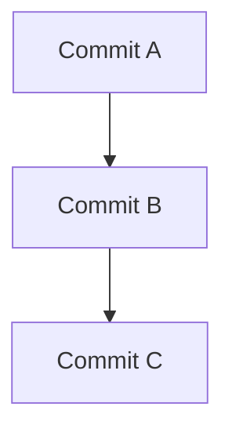
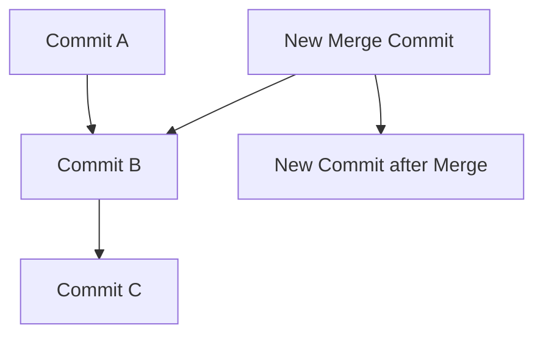
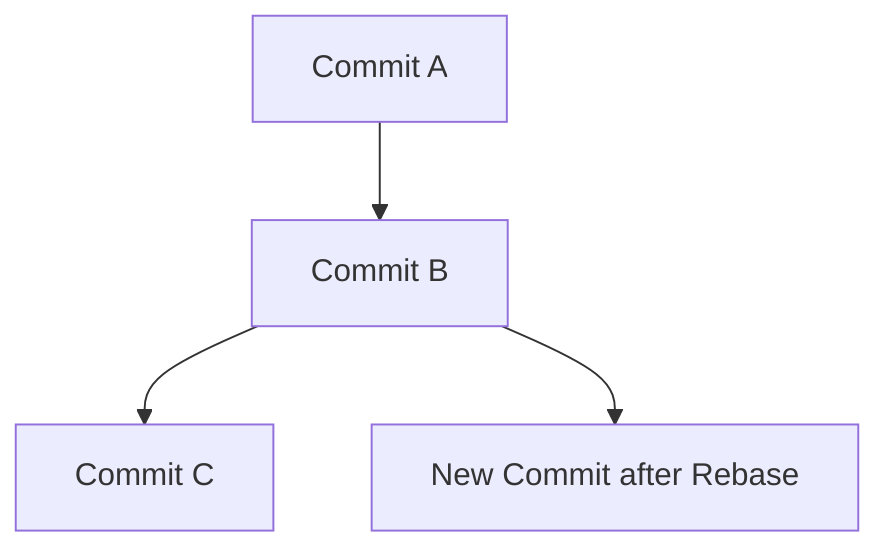
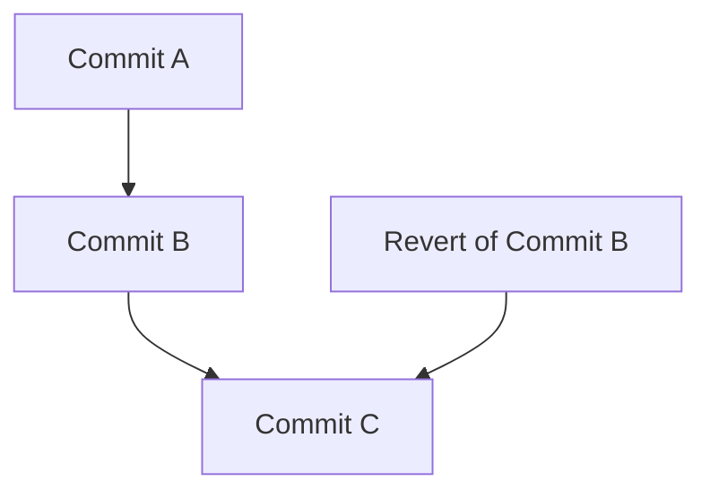
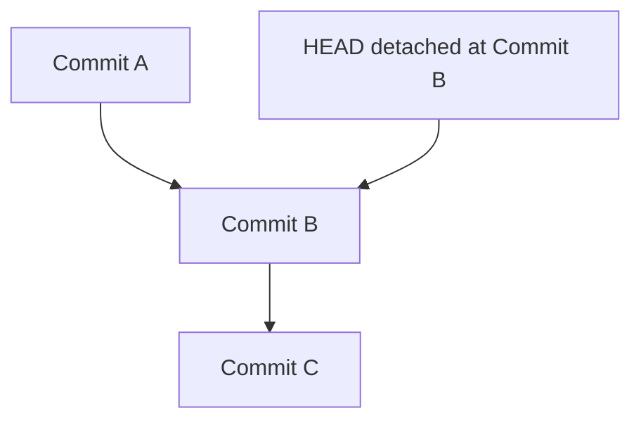

Mermaid 是一个流程图和图表的绘制工具，用来描述 git 中 `git rebase` 和 `git merge` 的区别非常合适。下面我用一些示例 commit 来说明它们之间的区别，并用 Mermaid 语法画出示意图。

### 示例 Commit

假设有以下一些提交：

- 初始状态：
  - Commit A: 695128da5bde79136a4ab86c4974f00ae5e017b2
  - Commit B: c1a2b3f4e5d6a7b8c9d0e1f2a3b4c5d6e7f8a9b0
  - Commit C: e5e5e5e5e5e5e5e5e5e5e5e5e5e5e5e5e5e5e5e5e5

### Mermaid 图表解释

下面是使用 Mermaid 语法绘制的图表，分别展示了 `git merge` 和 `git rebase` 的操作对提交历史的影响：

#### 1. Git Merge 示例图

在这个示例中，我们首先进行了 `git merge` 操作，合并了一个新的分支，形成一个合并提交：

在这个示意图中：

- `Commit A`, `Commit B` 和 `Commit C` 是原始的提交历史。
- `New Merge Commit` 是由 `git merge` 操作创建的合并提交，将 `Commit C` 和 `New Commit after Merge` 合并到一起。

#### 2. Git Rebase 示例图

接下来，我们展示 `git rebase` 操作对提交历史的影响：

在这个示意图中：

- `Commit A`, `Commit B` 和 `Commit C` 是原始的提交历史。
- `New Commit after Rebase` 是由 `git rebase` 操作创建的新提交，它将 `Commit C` 应用在 `Commit B` 之后，形成一个线性的提交历史。

### 总结

- **Git Merge** 创建一个合并提交，将两个分支的提交合并在一起，保留了原来的提交历史。
- **Git Rebase** 将当前分支的提交逐个应用在目标分支的最新提交之后，形成一个线性的提交历史。

这些示意图帮助说明了 `git rebase` 和 `git merge` 操作对提交历史的不同影响，希望能够帮助你更好地理解它们的区别和用途。

当使用 Mermaid 语法来解释 `git revert` 和 `git checkout` 命令时，我们可以通过示意图来展示它们对提交历史和工作目录的影响。

### 示例 Commit

假设有以下一些提交：

- 初始状态：
  - Commit A: 695128da5bde79136a4ab86c4974f00ae5e017b2
  - Commit B: c1a2b3f4e5d6a7b8c9d0e1f2a3b4c5d6e7f8a9b0
  - Commit C: e5e5e5e5e5e5e5e5e5e5e5e5e5e5e5e5e5e5e5e5

### Mermaid 图表解释

#### 1. Git Revert 示例图

在这个示例中，我们使用 `git revert` 命令来撤销一个特定的提交，创建一个新的撤销提交：

在这个示意图中：

- `Commit A`, `Commit B` 和 `Commit C` 是原始的提交历史。
- `Revert of Commit B` 是由 `git revert` 操作创建的新提交，用来撤销 `Commit B` 的更改。

#### 2. Git Checkout 示例图

接下来，我们展示 `git checkout` 命令对工作目录和 HEAD 指针的影响：

在这个示意图中：

- `Commit A`, `Commit B` 和 `Commit C` 是原始的提交历史。
- `HEAD detached at Commit B` 表示通过 `git checkout Commit B` 命令，将 HEAD 指针移动到 `Commit B`，并且工作目录变成 `Commit B` 的状态。这种状态称为“分离头指针”。

### 总结

- **Git Revert** 创建一个新的撤销提交，撤销指定提交及其后续更改。
- **Git Checkout** 将 HEAD 指针移动到指定的提交或者分支，可以用来查看历史版本或者在分离头指针状态下进行临时工作。

这些示意图帮助说明了 `git revert` 和 `git checkout` 命令在提交历史和工作目录管理中的不同作用和影响。